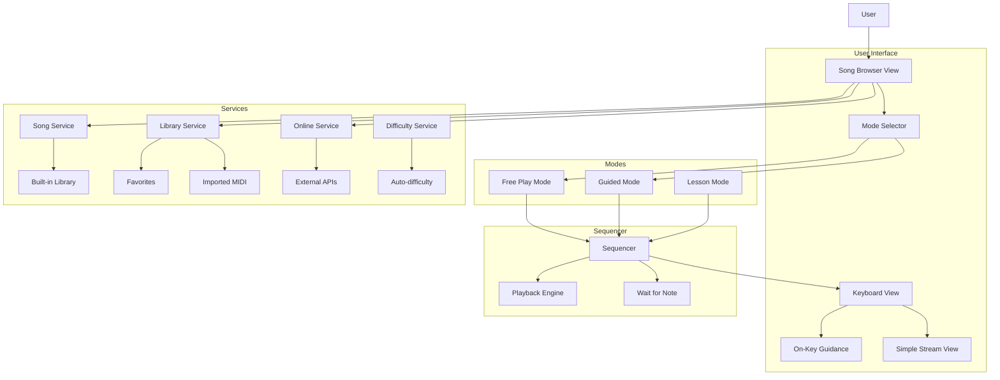

# Learning Feature Improvement Plan

## Overview
Transform the learning feature into a user-friendly, guided experience with a comprehensive song library system.

## Current State Analysis
- **KeyStreamView.js**: Uses a "Guitar Hero" style multi-lane stream view
- **SongService.js**: Contains only 2 hardcoded songs
- **MidiService.js**: Can parse MIDI files
- **SongSelectView.js**: Basic modal with search and drag-drop
- **Sequencer.js**: Handles playback with wait mode, speed, difficulty

## Goals
1. **Simplified UI** - Piano roll on keyboard keys with guided step-by-step notes
2. **Expanded Library** - More built-in songs with search/filter
3. **Song Lookup** - Internet search and community sharing
4. **User Choice** - Guided vs Free play with auto-generated difficulty levels

---

## Phase 1: Simplified Learning UI

### 1.1 On-Key Guidance System
**File**: `Keyboard/src/ui/KeyboardView.js`

Add visual indicators directly on piano keys showing the next note to play:

```javascript
// New method in KeyboardView class
highlightNextNote(noteNames) {
    // Clear all highlights first
    this.keys.forEach((el, noteFullName) => {
        el.classList.remove('next-note', 'chord-note', 'correct-note', 'wrong-note');
    });
    
    // Highlight the target notes
    noteNames.forEach(noteName => {
        const el = this.keys.get(noteName);
        if (el) {
            el.classList.add(noteNames.length > 1 ? 'chord-note' : 'next-note');
        }
    });
}

clearHighlights() {
    this.keys.forEach((el) => {
        el.classList.remove('next-note', 'chord-note', 'correct-note', 'wrong-note');
    });
}

showCorrectNote(noteName) {
    const el = this.keys.get(noteName);
    if (el) {
        el.classList.add('correct-note');
        setTimeout(() => el.classList.remove('correct-note'), 300);
    }
}

showWrongNote(noteName) {
    const el = this.keys.get(noteName);
    if (el) {
        el.classList.add('wrong-note');
        setTimeout(() => el.classList.remove('wrong-note'), 300);
    }
}
```

### 1.2 CSS Styling for On-Key Guidance
**File**: `Keyboard/styles/main.css`

```css
/* On-Key Guidance Styles */
.key.next-note {
    animation: pulse-glow 1s infinite ease-in-out;
    z-index: 10;
}

.key.chord-note {
    animation: pulse-glow-chord 1s infinite ease-in-out;
    z-index: 10;
}

.key.correct-note {
    background: linear-gradient(180deg, #4ade80 0%, #22c55e 100%) !important;
    box-shadow: 0 0 20px #22c55e, 0 0 40px #22c55e !important;
}

.key.wrong-note {
    background: linear-gradient(180deg, #f87171 0%, #ef4444 100%) !important;
    box-shadow: 0 0 20px #ef4444, 0 0 40px #ef4444 !important;
}

@keyframes pulse-glow {
    0%, 100% {
        box-shadow: 0 0 10px var(--accent-primary), 0 0 20px var(--accent-primary);
        transform: translateY(0);
    }
    50% {
        box-shadow: 0 0 25px var(--accent-primary), 0 0 50px var(--accent-primary);
        transform: translateY(-2px);
    }
}

@keyframes pulse-glow-chord {
    0%, 100% {
        box-shadow: 0 0 10px #fbbf24, 0 0 20px #fbbf24;
        transform: translateY(0);
    }
    50% {
        box-shadow: 0 0 25px #fbbf24, 0 0 50px #fbbf24;
        transform: translateY(-2px);
    }
}
```

### 1.3 Simplified Stream View (Optional Fallback)
**File**: `Keyboard/src/ui/SimpleStreamView.js`

Create a simplified version for users who prefer the stream view:
- Single lane with clear separation
- Larger note blocks (60px height)
- Color-coded by hand (left/right)
- Optional toggle between "Key View" and "Stream View"

### 1.4 Step-by-Step Mode
**File**: `Keyboard/src/modes/GuidedMode.js`

New mode that pauses between notes:

```javascript
export class GuidedMode {
    constructor(stateManager, sequencer) {
        this.stateManager = stateManager;
        this.sequencer = sequencer;
        this.name = 'guided';
        this.isWaitingForNote = false;
        this.currentTargetNotes = [];
        this.onNoteRequired = null; // Callback for UI updates
    }

    enter() {
        console.log('Entered Guided Mode');
        this.isWaitingForNote = false;
        this.setupSequencerCallbacks();
    }

    setupSequencerCallbacks() {
        this.sequencer.onNoteRequired = (notes) => {
            this.currentTargetNotes = notes;
            this.isWaitingForNote = true;
            if (this.onNoteRequired) {
                this.onNoteRequired(notes);
            }
        };
    }

    handleNote(noteEvent) {
        if (noteEvent.type === 'noteOn' && this.isWaitingForNote) {
            const playedNote = noteEvent.fullName;
            
            // Check if correct note (handles chords)
            if (this.currentTargetNotes.includes(playedNote)) {
                // Remove from waiting list
                const index = this.currentTargetNotes.indexOf(playedNote);
                this.currentTargetNotes.splice(index, 1);
                
                // If all notes in chord are played, advance
                if (this.currentTargetNotes.length === 0) {
                    this.isWaitingForNote = false;
                    this.sequencer.advance();
                }
                
                return noteEvent; // Allow sound
            } else {
                // Wrong note
                if (this.onWrongNote) {
                    this.onWrongNote(playedNote);
                }
                return null; // Block sound
            }
        }
        return noteEvent;
    }

    exit() {
        this.isWaitingForNote = false;
        this.currentTargetNotes = [];
    }
}
```

---

## Phase 2: Enhanced Song Library System

### 2.1 Expand Built-in Songs
**File**: `Keyboard/src/services/SongService.js`

Add more songs with difficulty ratings and categories:

```javascript
this.songs = [
    // Beginner - Single hand, slow tempo
    {
        id: 'twinkle',
        title: 'Twinkle Twinkle Little Star',
        difficulty: 'beginner',
        category: 'children',
        bpm: 80,
        description: 'A classic children\'s song, perfect for beginners',
        hands: 'right',
        tracks: [{
            instrument: 'piano',
            notes: [
                { note: 'C4', duration: 1, start: 0 },
                { note: 'C4', duration: 1, start: 1 },
                { note: 'G4', duration: 1, start: 2 },
                { note: 'G4', duration: 1, start: 3 },
                { note: 'A4', duration: 1, start: 4 },
                { note: 'A4', duration: 1, start: 5 },
                { note: 'G4', duration: 2, start: 6 },
            ]
        }]
    },
    {
        id: 'hot_cross_buns',
        title: 'Hot Cross Buns',
        difficulty: 'beginner',
        category: 'children',
        bpm: 100,
        hands: 'right',
        tracks: [{
            instrument: 'piano',
            notes: [
                { note: 'E4', duration: 1, start: 0 },
                { note: 'E4', duration: 1, start: 1 },
                { note: 'D4', duration: 1, start: 2 },
                { note: 'D4', duration: 1, start: 3 },
                { note: 'C4', duration: 2, start: 4 },
            ]
        }]
    },
    {
        id: 'mary_had_lamb',
        title: 'Mary Had a Little Lamb',
        difficulty: 'beginner',
        category: 'children',
        bpm: 90,
        hands: 'right',
        tracks: [{
            instrument: 'piano',
            notes: [
                { note: 'E4', duration: 1, start: 0 },
                { note: 'D4', duration: 1, start: 1 },
                { note: 'C4', duration: 1, start: 2 },
                { note: 'D4', duration: 1, start: 3 },
                { note: 'E4', duration: 1, start: 4 },
                { note: 'E4', duration: 1, start: 5 },
                { note: 'E4', duration: 2, start: 6 },
            ]
        }]
    },
    
    // Easy - Both hands, simple melodies
    {
        id: 'fur_elise_simple',
        title: 'Für Elise (Simplified)',
        difficulty: 'easy',
        category: 'classical',
        bpm: 100,
        hands: 'right',
        tracks: [{
            instrument: 'piano',
            notes: [
                { note: 'E5', duration: 0.5, start: 0 },
                { note: 'D#5', duration: 0.5, start: 0.5 },
                { note: 'E5', duration: 0.5, start: 1 },
                { note: 'D#5', duration: 0.5, start: 1.5 },
                { note: 'E5', duration: 0.5, start: 2 },
                { note: 'B4', duration: 0.5, start: 2.5 },
                { note: 'D5', duration: 0.5, start: 3 },
                { note: 'C5', duration: 0.5, start: 3.5 },
                { note: 'A4', duration: 1, start: 4 },
            ]
        }]
    },
    {
        id: ' Ode_to_Joy',
        title: 'Ode to Joy',
        difficulty: 'easy',
        category: 'classical',
        bpm: 100,
        hands: 'both',
        tracks: [{
            instrument: 'piano',
            notes: [
                { note: 'E4', duration: 1, start: 0 },
                { note: 'E4', duration: 1, start: 1 },
                { note: 'F4', duration: 1, start: 2 },
                { note: 'G4', duration: 1, start: 3 },
                { note: 'G4', duration: 1, start: 4 },
                { note: 'F4', duration: 1, start: 5 },
                { note: 'E4', duration: 1, start: 6 },
                { note: 'D4', duration: 1, start: 7 },
            ]
        }]
    },
    
    // Medium - With chords and faster tempo
    {
        id: 'canon_main_melody',
        title: 'Canon in D (Main Melody)',
        difficulty: 'medium',
        category: 'classical',
        bpm: 80,
        hands: 'right',
        tracks: [{
            instrument: 'piano',
            notes: [
                { note: 'D4', duration: 2, start: 0 },
                { note: 'A3', duration: 2, start: 2 },
                { note: 'B3', duration: 1, start: 4 },
                { note: 'C4', duration: 1, start: 5 },
                { note: 'D4', duration: 2, start: 6 },
                { note: 'A3', duration: 2, start: 8 },
            ]
        }]
    },
    {
        id: 'river_flows_simplified',
        title: 'River Flows in You (Simplified)',
        difficulty: 'medium',
        category: 'pop',
        bpm: 70,
        hands: 'right',
        tracks: [{
            instrument: 'piano',
            notes: [
                { note: 'A4', duration: 1.5, start: 0 },
                { note: 'C5', duration: 0.5, start: 1.5 },
                { note: 'B4', duration: 1, start: 2 },
                { note: 'G4', duration: 2, start: 3 },
                { note: 'A4', duration: 1.5, start: 5 },
                { note: 'C5', duration: 0.5, start: 6.5 },
            ]
        }]
    },
    
    // Hard - Full arrangements
    {
        id: 'moonlight_sonata_1',
        title: 'Moonlight Sonata 1st Movement',
        difficulty: 'hard',
        category: 'classical',
        bpm: 60,
        hands: 'both',
        tracks: [{
            instrument: 'piano',
            notes: [
                { note: 'C#4', duration: 4, start: 0 },
                { note: 'C#4', duration: 4, start: 4 },
                { note: 'C#4', duration: 2, start: 8 },
                { note: 'D#4', duration: 2, start: 10 },
                { note: 'F#4', duration: 2, start: 12 },
                { note: 'F#4', duration: 2, start: 14 },
            ]
        }]
    },
    
    // Scales and exercises
    {
        id: 'c_major_scale',
        title: 'C Major Scale',
        difficulty: 'beginner',
        category: 'scales',
        bpm: 80,
        hands: 'both',
        tracks: [{
            instrument: 'piano',
            notes: [
                { note: 'C4', duration: 0.5, start: 0 },
                { note: 'D4', duration: 0.5, start: 0.5 },
                { note: 'E4', duration: 0.5, start: 1 },
                { note: 'F4', duration: 0.5, start: 1.5 },
                { note: 'G4', duration: 0.5, start: 2 },
                { note: 'A4', duration: 0.5, start: 2.5 },
                { note: 'B4', duration: 0.5, start: 3 },
                { note: 'C5', duration: 0.5, start: 3.5 },
            ]
        }]
    },
];
```

### 2.2 Song Categories
Add categorization:
- **By Difficulty**: Beginner, Easy, Medium, Hard, Expert
- **By Style**: Classical, Pop, Folk, Jazz, Christmas, Children, Exercises
- **By Technique**: Scales, Chords, Arpeggios, Finger Training

### 2.3 LocalStorage Persistence
**File**: `Keyboard/src/services/SongLibraryService.js`

```javascript
export class SongLibraryService {
    constructor(songService) {
        this.songService = songService;
        this.STORAGE_KEYS = {
            FAVORITES: 'keyboard_favorites',
            CUSTOM: 'keyboard_custom_songs',
            RECENT: 'keyboard_recent_songs',
            PROGRESS: 'keyboard_progress'
        };
    }

    getFavorites() {
        return JSON.parse(localStorage.getItem(this.STORAGE_KEYS.FAVORITES) || '[]');
    }

    saveFavoriteSong(songId) {
        const favorites = this.getFavorites();
        if (!ongId)) {
favorites.includes(s            favorites.push(songId);
            localStorage.setItem(this.STORAGE_KEYS.FAVORITES, JSON.stringify(favorites));
        }
    }

    removeFavoriteSong(songId) {
        const favorites = this.getFavorites().filter(id => id !== songId);
        localStorage.setItem(this.STORAGE_KEYS.FAVORITES, JSON.stringify(favorites));
    }

    isFavorite(songId) {
        return this.getFavorites().includes(songId);
    }

    addCustomSong(song) {
        const customSongs = this.getCustomSongs();
        song.id = `custom_${Date.now()}`;
        song.isCustom = true;
        customSongs.push(song);
        localStorage.setItem(this.STORAGE_KEYS.CUSTOM, JSON.stringify(customSongs));
        return song;
    }

    getCustomSongs() {
        return JSON.parse(localStorage.getItem(this.STORAGE_KEYS.CUSTOM) || '[]');
    }

    addToRecent(songId) {
        const recent = this.getRecent();
        // Remove if already exists
        const filtered = recent.filter(id => id !== songId);
        // Add to front
        filtered.unshift(songId);
        // Keep only last 10
        const trimmed = filtered.slice(0, 10);
        localStorage.setItem(this.STORAGE_KEYS.RECENT, JSON.stringify(trimmed));
    }

    getRecent() {
        return JSON.parse(localStorage.getItem(this.STORAGE_KEYS.RECENT) || '[]');
    }

    saveSongProgress(songId, progress) {
        const allProgress = this.getAllProgress();
        allProgress[songId] = progress;
        localStorage.setItem(this.STORAGE_KEYS.PROGRESS, JSON.stringify(allProgress));
    }

    getSongProgress(songId) {
        const allProgress = this.getAllProgress();
        return allProgress[songId] || null;
    }

    getAllProgress() {
        return JSON.parse(localStorage.getItem(this.STORAGE_KEYS.PROGRESS) || '{}');
    }
}
```

---

## Phase 3: Song Lookup & Internet Search

### 3.1 Song Browser Modal (Redesign)
**File**: `Keyboard/src/ui/SongBrowserView.js`

New comprehensive song browser with tabs and filters:

```javascript
export class SongBrowserView {
    constructor(container, songService, libraryService, onSelect) {
        this.container = container;
        this.songService = songService;
        this.libraryService = libraryService;
        this.onSelect = onSelect;
        this.currentTab = 'library';
        this.currentFilter = { difficulty: null, category: null };
    }

    render() {
        this.element = document.createElement('div');
        this.element.className = 'modal-overlay';
        this.element.innerHTML = `
            <div class="song-browser">
                <div class="browser-header">
                    <h2>Song Library</h2>
                    <button id="close-browser">×</button>
                </div>
                
                <div class="browser-tabs">
                    <button class="tab active" data-tab="library">Library</button>
                    <button class="tab" data-tab="favorites">Favorites</button>
                    <button class="tab" data-tab="recent">Recent</button>
                    <button class="tab" data-tab="import">Import MIDI</button>
                    <button class="tab" data-tab="online">Online</button>
                </div>
                
                <div class="browser-filters">
                    <select id="filter-difficulty">
                        <option value="">All Difficulties</option>
                        <option value="beginner">Beginner</option>
                        <option value="easy">Easy</option>
                        <option value="medium">Medium</option>
                        <option value="hard">Hard</option>
                    </select>
                    <select id="filter-category">
                        <option value="">All Categories</option>
                        <option value="classical">Classical</option>
                        <option value="pop">Pop</option>
                        <option value="children">Children</option>
                        <option value="scales">Scales</option>
                    </select>
                </div>
                
                <div class="browser-search">
                    <input type="text" id="search-input" placeholder="Search songs...">
                </div>
                
                <div class="song-list" id="song-list"></div>
            </div>
        `;
        
        this.container.appendChild(this.element);
        this.bindEvents();
        this.loadSongs();
    }

    bindEvents() {
        // Tab switching
        this.element.querySelectorAll('.tab').forEach(tab => {
            tab.addEventListener('click', (e) => {
                this.element.querySelectorAll('.tab').forEach(t => t.classList.remove('active'));
                e.target.classList.add('active');
                this.currentTab = e.target.dataset.tab;
                this.loadSongs();
            });
        });

        // Filters
        document.getElementById('filter-difficulty').addEventListener('change', (e) => {
            this.currentFilter.difficulty = e.target.value || null;
            this.loadSongs();
        });
        
        document.getElementById('filter-category').addEventListener('change', (e) => {
            this.currentFilter.category = e.target.value || null;
            this.loadSongs();
        });

        // Search
        document.getElementById('search-input').addEventListener('input', (e) => {
            this.searchQuery = e.target.value.toLowerCase();
            this.loadSongs();
        });
    }

    loadSongs() {
        let songs = [];
        
        switch (this.currentTab) {
            case 'library':
                songs = this.songService.getAllSongs();
                break;
            case 'favorites':
                const favIds = this.libraryService.getFavorites();
                songs = favIds.map(id => this.songService.getSongById(id)).filter(Boolean);
                break;
            case 'recent':
                const recentIds = this.libraryService.getRecent();
                songs = recentIds.map(id => this.songService.getSongById(id)).filter(Boolean);
                break;
            case 'import':
                this.showImportArea();
                return;
            case 'online':
                this.showOnlineSearch();
                return;
        }
        
        // Apply filters
        if (this.currentFilter.difficulty) {
            songs = songs.filter(s => s.difficulty === this.currentFilter.difficulty);
        }
        if (this.currentFilter.category) {
            songs = songs.filter(s => s.category === this.currentFilter.category);
        }
        if (this.searchQuery) {
            songs = songs.filter(s => s.title.toLowerCase().includes(this.searchQuery));
        }
        
        this.renderSongList(songs);
    }

    renderSongList(songs) {
        const list = this.element.querySelector('#song-list');
        list.innerHTML = '';
        
        if (songs.length === 0) {
            list.innerHTML = '<div class="no-songs">No songs found</div>';
            return;
        }
        
        songs.forEach(song => {
            const item = document.createElement('div');
            item.className = 'song-item';
            item.innerHTML = `
                <div class="song-info">
                    <div class="song-title">${song.title}</div>
                    <div class="song-meta">
                        <span class="difficulty-badge ${song.difficulty}">${song.difficulty}</span>
                        <span>${song.bpm} BPM</span>
                        <span>${song.hands || 'both'} hand</span>
                    </div>
                </div>
                <button class="play-btn">▶</button>
            `;
            
            item.querySelector('.play-btn').addEventListener('click', () => {
                this.libraryService.addToRecent(song.id);
                this.onSelect(song);
                this.close();
            });
            
            list.appendChild(item);
        });
    }
}
```

### 3.2 CSS for Song Browser
```css
.song-browser {
    background: var(--glass-bg);
    backdrop-filter: blur(var(--glass-blur));
    border: 1px solid var(--glass-border);
    border-radius: var(--radius-md);
    width: 90%;
    max-width: 600px;
    max-height: 80vh;
    display: flex;
    flex-direction: column;
}

.browser-header {
    display: flex;
    justify-content: space-between;
    align-items: center;
    padding: var(--space-md);
    border-bottom: 1px solid var(--glass-border);
}

.browser-tabs {
    display: flex;
    gap: var(--space-sm);
    padding: var(--space-md);
    border-bottom: 1px solid var(--glass-border);
}

.browser-tabs .tab {
    background: transparent;
    border: none;
    color: var(--text-muted);
    padding: var(--space-sm) var(--space-md);
    border-radius: var(--radius-sm);
    cursor: pointer;
    transition: all 0.2s;
}

.browser-tabs .tab.active {
    background: var(--accent-primary);
    color: var(--bg-deep);
}

.browser-filters {
    display: flex;
    gap: var(--space-md);
    padding: var(--space-md);
    background: rgba(0, 0, 0, 0.2);
}

.browser-filters select {
    background: rgba(255, 255, 255, 0.05);
    border: 1px solid var(--glass-border);
    color: var(--text-main);
    padding: 6px 12px;
    border-radius: var(--radius-sm);
}

.browser-search {
    padding: var(--space-md);
}

.browser-search input {
    width: 100%;
    background: rgba(255, 255, 255, 0.05);
    border: 1px solid var(--glass-border);
    color: var(--text-main);
    padding: 10px 16px;
    border-radius: var(--radius-sm);
    font-size: 14px;
}

.song-list {
    flex: 1;
    overflow-y: auto;
    padding: var(--space-md);
}

.song-item {
    display: flex;
    justify-content: space-between;
    align-items: center;
    padding: var(--space-md);
    background: rgba(255, 255, 255, 0.03);
    border-radius: var(--radius-sm);
    margin-bottom: var(--space-sm);
    transition: background 0.2s;
}

.song-item:hover {
    background: rgba(255, 255, 255, 0.08);
}

.song-info {
    flex: 1;
}

.song-title {
    font-weight: 600;
    margin-bottom: 4px;
}

.song-meta {
    display: flex;
    gap: var(--space-md);
    font-size: 12px;
    color: var(--text-muted);
}

.difficulty-badge {
    padding: 2px 8px;
    border-radius: var(--radius-full);
    font-size: 10px;
    text-transform: uppercase;
}

.difficulty-badge.beginner { background: #4ade80; color: #000; }
.difficulty-badge.easy { background: #a3e635; color: #000; }
.difficulty-badge.medium { background: #fbbf24; color: #000; }
.difficulty-badge.hard { background: #f97316; color: #fff; }

.song-item .play-btn {
    background: var(--accent-primary);
    color: var(--bg-deep);
    border: none;
    width: 40px;
    height: 40px;
    border-radius: 50%;
    cursor: pointer;
    display: flex;
    align-items: center;
    justify-content: center;
    font-size: 16px;
}
```

### 3.3 Online Song Search
**File**: `Keyboard/src/services/OnlineSongService.js`

Integration with MIDI databases:

```javascript
export class OnlineSongService {
    constructor() {
        this.sources = [
            { name: 'MuseScore', baseUrl: 'https://api.musescore.com' },
            { name: 'MIDI World', baseUrl: 'https://www.midiworld.com' },
            { name: 'Free MIDI', baseUrl: 'https://freemidi.org' }
        ];
    }

    async search(query) {
        // Note: This is a placeholder - actual APIs may require authentication
        // For now, we'll simulate the search
        
        const mockResults = [
            {
                id: 'online_1',
                title: `${query} - Version 1`,
                source: 'MuseScore',
                difficulty: 'medium',
                downloadUrl: '#',
                previewUrl: '#'
            },
            {
                id: 'online_2',
                title: `${query} - Easy Arrangement`,
                source: 'Free MIDI',
                difficulty: 'easy',
                downloadUrl: '#',
                previewUrl: '#'
            }
        ];
        
        return mockResults;
    }

    async downloadSong(songId) {
        // Download and parse MIDI file
        const response = await fetch(songId.downloadUrl);
        const blob = await response.blob();
        return blob;
    }
}
```

---

## Phase 4: Difficulty Levels & User Choice

### 4.1 Auto-Generate Difficulty
**File**: `Keyboard/src/services/DifficultyService.js`

```javascript
export class DifficultyService {
    constructor(midiService) {
        this.midiService = midiService;
    }

    generateDifficulties(song) {
        return {
            beginner: this.createBeginnerVersion(song),
            easy: this.createEasyVersion(song),
            medium: this.createMediumVersion(song),
            hard: this.createHardVersion(song),
            original: song
        };
    }

    createBeginnerVersion(song) {
        // Keep only melody (highest pitch notes at each time)
        // Remove all chords - single notes only
        // Increase tempo slightly for practice
        
        const simplifiedNotes = [];
        const notesByTime = new Map();
        
        song.tracks.forEach(track => {
            track.notes.forEach(note => {
                if (!notesByTime.has(note.start)) {
                    notesByTime.set(note.start, []);
                }
                notesByTime.get(note.start).push(note);
            });
        });
        
        // Keep highest pitch note at each time
        notesByTime.forEach((notes, startTime) => {
            const highest = notes.reduce((prev, curr) => {
                return this.getMidiNumber(curr.note) > this.getMidiNumber(prev.note) ? curr : prev;
            });
            simplifiedNotes.push({ ...highest });
        });
        
        // Sort by start time
        simplifiedNotes.sort((a, b) => a.start - b.start);
        
        return {
            ...song,
            id: `${song.id}_beginner`,
            title: `${song.title} (Beginner)`,
            difficulty: 'beginner',
            tracks: [{
                ...song.tracks[0],
                notes: simplifiedNotes
            }],
            bpm: Math.round(song.bpm * 0.8) // Slower for beginners
        };
    }

    createEasyVersion(song) {
        // Keep melody + simple chord approximations
        // Reduce complex chords to single notes
        
        const simplifiedNotes = [];
        
        song.tracks.forEach(track => {
            track.notes.forEach(note => {
                // Keep notes but simplify timing
                simplifiedNotes.push({
                    ...note,
                    duration: Math.max(note.duration, 0.5) // Minimum duration
                });
            });
        });
        
        return {
            ...song,
            id: `${song.id}_easy`,
            title: `${song.title} (Easy)`,
            difficulty: 'easy',
            tracks: [{
                ...song.tracks[0],
                notes: simplifiedNotes
            }]
        };
    }

    createMediumVersion(song) {
        // Keep original but remove complex passages
        // Reduce hand movement
        
        return {
            ...song,
            id: `${song.id}_medium`,
            title: `${song.title} (Medium)`,
            difficulty: 'medium'
        };
    }

    createHardVersion(song) {
        // Full original version
        return {
            ...song,
            id: `${song.id}_hard`,
            title: `${song.title} (Hard)`,
            difficulty: 'hard'
        };
    }

    getMidiNumber(noteName) {
        const notes = { 'C': 0, 'C#': 1, 'D': 2, 'D#': 3, 'E': 4, 'F': 5, 'F#': 6, 'G': 7, 'G#': 8, 'A': 9, 'A#': 10, 'B': 11 };
        const match = noteName.match(/([A-G]#?)(\d)/);
        if (match) {
            return notes[match[1]] + (parseInt(match[2]) + 1) * 12;
        }
        return 60; // Default to C4
    }
}
```

### 4.2 Mode Selection Modal
**File**: `Keyboard/src/ui/PlayModeSelector.js`

```javascript
export class PlayModeSelector {
    constructor(container, song, onSelect) {
        this.container = container;
        this.song = song;
        this.onSelect = onSelect;
    }

    render() {
        this.element = document.createElement('div');
        this.element.className = 'modal-overlay';
        this.element.innerHTML = `
            <div class="mode-selector">
                <h2>How do you want to play "${this.song.title}"?</h2>
                
                <div class="mode-options">
                    <div class="mode-option" data-mode="guided">
                        <div class="mode-icon">🎯</div>
                        <div class="mode-title">Guided Mode</div>
                        <div class="mode-desc">Step-by-step with visual hints</div>
                        <div class="mode-settings">
                            <label>
                                <input type="checkbox" id="wait-mode" checked>
                                Wait for correct note
                            </label>
                            <label>
                                <input type="radio" name="display" value="key" checked>
                                Show on keyboard
                            </label>
                            <label>
                                <input type="radio" name="display" value="stream">
                                Show stream view
                            </label>
                        </div>
                    </div>
                    
                    <div class="mode-option" data-mode="free">
                        <div class="mode-icon">🎵</div>
                        <div class="mode-title">Free Play Mode</div>
                        <div class="mode-desc">Play along at your own pace</div>
                        <div class="mode-settings">
                            <label>
                                <input type="checkbox" id="show-hints">
                                Show note hints
                            </label>
                            <label>
                                <input type="checkbox" id="auto-play">
                                Auto-play demonstration
                            </label>
                        </div>
                    </div>
                </div>
                
                <div class="difficulty-selector">
                    <label>Difficulty:</label>
                    <select id="difficulty-select">
                        <option value="beginner">Beginner</option>
                        <option value="easy">Easy</option>
                        <option value="medium" selected>Medium</option>
                        <option value="hard">Hard</option>
                    </select>
                </div>
                
                <div class="mode-actions">
                    <button id="cancel-btn" class="secondary">Cancel</button>
                    <button id="start-btn" class="primary">Start</button>
                </div>
            </div>
        `;
        
        this.container.appendChild(this.element);
        this.bindEvents();
    }

    bindEvents() {
        document.getElementById('cancel-btn').addEventListener('click', () => this.close());
        document.getElementById('start-btn').addEventListener('click', () => this.start());
        
        // Mode selection styling
        this.element.querySelectorAll('.mode-option').forEach(option => {
            option.addEventListener('click', () => {
                this.element.querySelectorAll('.mode-option').forEach(o => o.classList.remove('selected'));
                option.classList.add('selected');
            });
        });
    }

    start() {
        const mode = this.element.querySelector('.mode-option.selected')?.dataset.mode || 'guided';
        const difficulty = document.getElementById('difficulty-select').value;
        const settings = {
            waitMode: document.getElementById('wait-mode')?.checked ?? true,
            showOnKeyboard: document.querySelector('input[name="display"]:checked')?.value === 'key',
            showHints: document.getElementById('show-hints')?.checked ?? false,
            autoPlay: document.getElementById('auto-play')?.checked ?? false
        };
        
        this.onSelect({
            song: this.song,
            mode,
            difficulty,
            settings
        });
        this.close();
    }

    close() {
        this.element.remove();
    }
}
```

---

## Phase 5: Polish & Testing

### 5.1 Visual Improvements
- Smooth animations for note highlighting
- Progress bar showing song position
- Remaining notes count
- Completion celebration animation

### 5.2 Feedback System
- Score based on accuracy (0-100%)
- Timing feedback (early/on-time/late within 100ms)
- Streak counter (consecutive correct notes)
- Achievement badges for milestones

### 5.3 Accessibility
- Keyboard shortcuts (Space to start/stop, arrows to navigate)
- Screen reader support (ARIA labels)
- High contrast mode toggle
- Reduced motion option in CSS

---

## File Changes Summary

| File | Changes |
|------|---------|
| `src/ui/KeyboardView.js` | Add on-key highlighting methods (highlightNextNote, clearHighlights, showCorrectNote, showWrongNote) |
| `src/ui/SimpleStreamView.js` | New simplified stream view for fallback |
| `src/modes/GuidedMode.js` | New guided mode class with step-by-step note handling |
| `src/services/SongService.js` | Expand song library (10+ songs), add categories |
| `src/services/SongLibraryService.js` | New service for favorites, custom songs, recent, progress |
| `src/services/OnlineSongService.js` | New service for online search integration |
| `src/services/DifficultyService.js` | New service for auto-difficulty generation |
| `src/ui/SongBrowserView.js` | Redesigned comprehensive browser with tabs and filters |
| `src/ui/PlayModeSelector.js` | New mode selection modal |
| `src/app.js` | Register new modes and services |
| `styles/main.css` | Add new styling classes for guidance, browser, mode selector |

---

## Mermaid: New Architecture Overview



---

## Implementation Order (Step by Step)

1. **Step 1**: Add CSS classes for on-key guidance in `main.css`
2. **Step 2**: Add highlighting methods to `KeyboardView.js`
3. **Step 3**: Create `GuidedMode.js` with step-by-step logic
4. **Step 4**: Expand `SongService.js` with 10+ songs
5. **Step 5**: Create `SongLibraryService.js` for persistence
6. **Step 6**: Create `SongBrowserView.js` with tabs and filters
7. **Step 7**: Create `PlayModeSelector.js` modal
8. **Step 8**: Create `DifficultyService.js` for auto-difficulty
9. **Step 9**: Update `app.js` to register new modes/services
10. **Step 10**: Test and polish

---

## Error Handling

| Scenario | Handling |
|----------|----------|
| Invalid MIDI file | Show error message, offer to try another file |
| Song not found | Show "Song not available" message |
| Network error (online search) | Show "Connection error" fallback to local library |
| Storage full | Warn user, offer to clear old data |
| Audio context blocked | Show "Click to enable audio" prompt |

---

## Performance Considerations

- Lazy load song data (only load when browsing)
- Debounce search input (300ms)
- Use CSS transforms for animations (GPU accelerated)
- Cleanup event listeners on component unmount
- Limit localStorage size (warn at 5MB)
